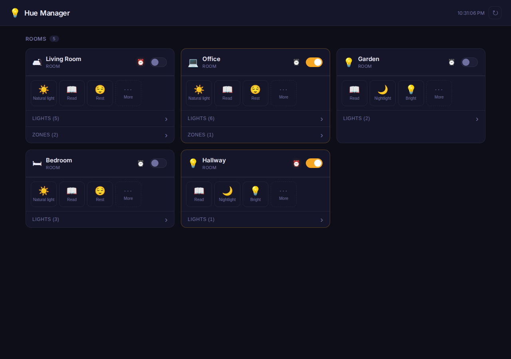
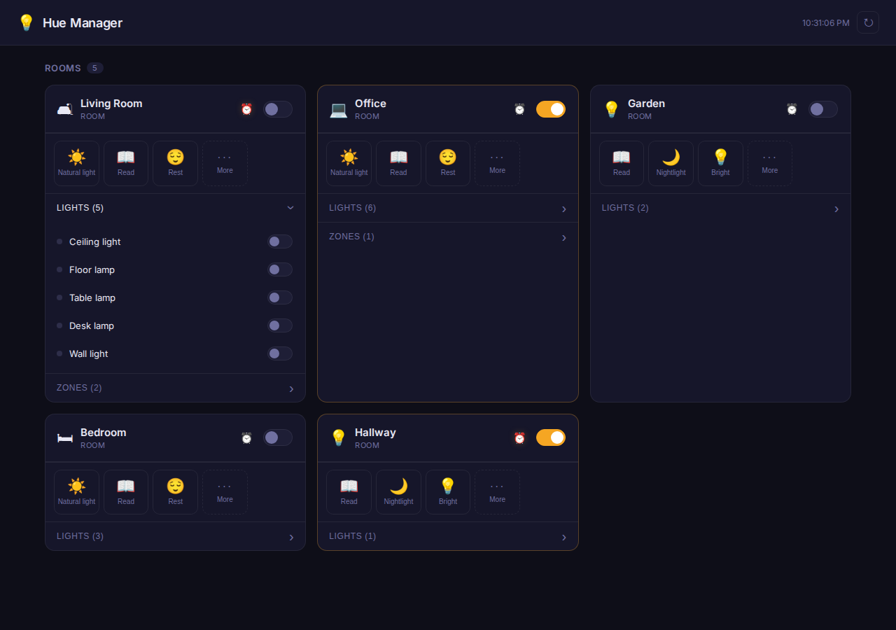
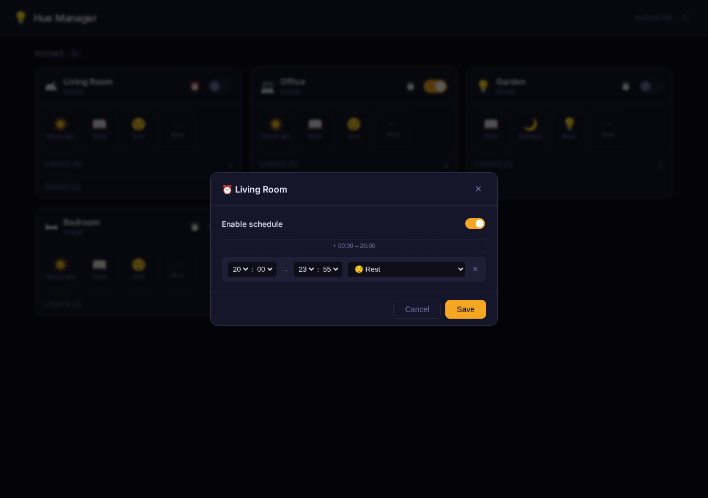

# Hue Manager

A local web app for managing Philips Hue lights. Provides a room-oriented UI for toggling lights, activating scenes, and scheduling automatic scene changes throughout the day.



## Stack

| Layer | Tech |
|---|---|
| Server | Node.js + Express + TypeScript (`ts-node`) |
| Client | React 18 + Vite + TypeScript |
| Bridge API | Hue v1 (`http`) + Hue v2 (`https/CLIP`) |

## Getting started

### 1. Authenticate with the bridge

Press the link button on your Hue bridge, then run:

```sh
npm run create-user
```

This writes your application key to `output/authenticated-users.txt`.

### 2. Configure environment

Create a `.env` file in the project root:

```ini
HUE_IP=192.168.x.x        # IP address of your Hue bridge
HUE_USER=<application-key> # Token from step 1 (or from the Hue developer portal)
PORT=3001                  # Optional, defaults to 3001
```

### 3. Run

```sh
npm install
cd client && npm install && cd ..
npm run dev
```

Opens the UI at **http://localhost:3000**. The server runs on port 3001; Vite proxies `/api` requests to it.

---

## Features

### Rooms and zones

Rooms are shown as cards in the main view. Zones that are a subset of a room's lights are linked to that room and shown in a collapsible panel inside the card. Zones that don't belong to any room appear in a separate collapsible section at the bottom.

### Light controls



Each room card shows its lights with individual on/off toggles (collapsed by default under a "Lights (N)" panel). The card header has a master toggle that turns all lights in the room on or off at once. Unreachable lights are visually dimmed and their toggles disabled.

### Scene selection

Scene buttons appear at the top of each card. The first three scenes are pinned in priority order:

1. **Natural light** — a Hue v2 smart scene that applies different sub-scenes based on the time of day (morning brightness, afternoon warmth, evening wind-down, etc.)
2. **Rest**
3. **Nightlight**

Remaining scenes are hidden behind a collapsible **···  More** button. Scenes are fetched from both the Hue v1 API (static `GroupScene` entries) and the Hue v2 API (`smart_scene` resources), merged, and associated with their room.

The active scene is highlighted. Activating a scene optimistically updates the UI and fires the bridge command in the background. The UI re-syncs with the bridge every 10 seconds.

### Scheduling



Each room has a ⏰ button in its header (grayscale when no active schedule, full colour when enabled).

Clicking it opens a modal with:

- An **enable/disable toggle** for the whole schedule
- A list of **time slots**, each with a start time, end time, and scene (including a "Turn off" option)
- **Gap buttons** (`+ HH:MM – HH:MM`) that appear wherever there is unscheduled time — before the first slot, between slots, and after the last slot — for quickly filling in the timeline

Time pickers use 24-hour paired selects (hour 00–23, minute in 5-minute steps). The available options are constrained by neighbouring slots, so overlapping or out-of-order configurations are structurally impossible to create.

Schedules are persisted to `data/schedules.json` and evaluated server-side every minute (aligned to the wall clock). The scheduler:

- Finds the active slot for each enabled room at the current minute
- For **scene slots**: applies the scene only if at least one light in the room is already on — lights that are off are left off
- For **"Turn off" slots**: unconditionally turns the room off

### Setup screen

If `HUE_USER` is missing from `.env`, the UI shows a "Bridge not configured" screen with setup instructions. If the token is present but rejected by the bridge, it shows an "Unauthorized" screen instead of silently showing an empty room list.

---

## Project structure

```
.
├── bin/                  # One-off CLI scripts (create-user, fetch-bridge-details)
├── client/               # Vite + React frontend
│   └── src/
│       ├── components/
│       │   ├── GroupCard.tsx     # Room/zone card with lights, scenes, schedule trigger
│       │   ├── ScheduleModal.tsx # Time-slot editor modal
│       │   └── SetupScreen.tsx   # Shown when bridge is not configured
│       ├── api.ts                # Typed fetch wrappers
│       ├── sceneIcons.ts         # Scene name → emoji map (shared)
│       └── types.ts              # Shared TypeScript interfaces
├── data/
│   └── schedules.json    # Persisted room schedules (auto-created)
├── server/
│   ├── hue.ts            # Hue bridge API wrapper (v1 + v2)
│   ├── schedules.ts      # Schedule storage + minute-aligned scheduler
│   └── index.ts          # Express routes
├── src/                  # Legacy CLI helpers (user auth, bridge discovery)
└── .env                  # Local config (not committed)
```

## API routes

| Method | Path | Description |
|---|---|---|
| `GET` | `/api/groups` | All rooms and zones with enriched light details |
| `GET` | `/api/lights` | All individual lights |
| `PUT` | `/api/lights/:id/state` | Set a single light's state |
| `PUT` | `/api/groups/:id/state` | Turn a group on or off |
| `GET` | `/api/scenes` | All scenes (static + smart), grouped by room |
| `PUT` | `/api/groups/:id/scene` | Activate a scene (static or smart) |
| `GET` | `/api/schedules` | All room schedules |
| `PUT` | `/api/schedules/:groupId` | Save a room's schedule |
